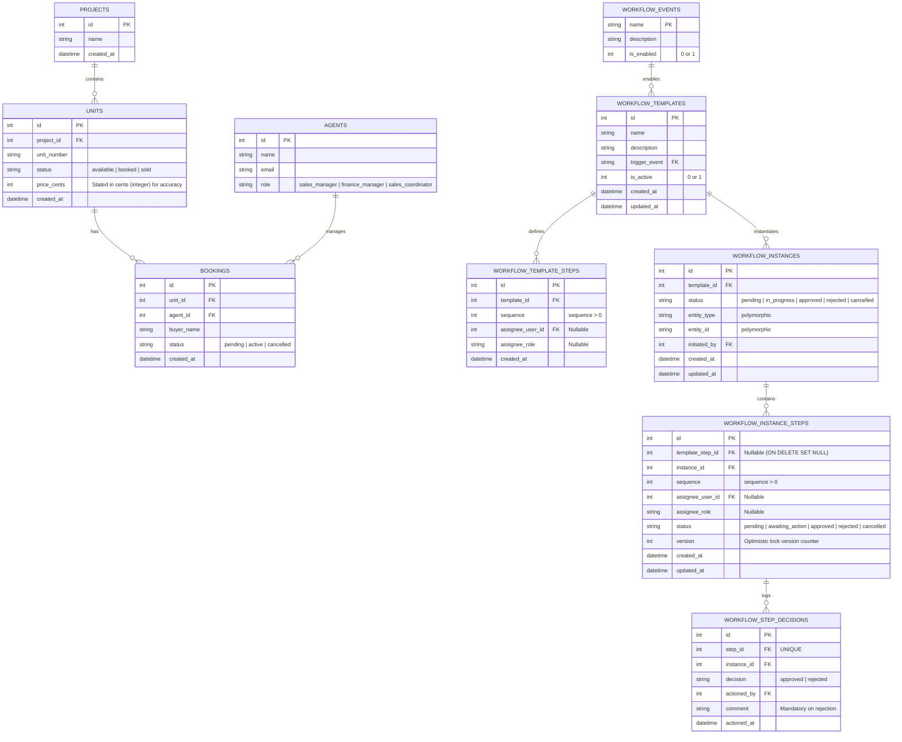

# MHUB Technical Challenge: Workflow Engine

A robust, enterprise-ready, configurable workflow engine built with **Node.js, TypeScript, Express, and SQLite (`better-sqlite3`)**. This engine is designed to manage approval workflows, enforce strict business rules, track step decisions, resolve concurrent updates safely using optimistic locking, and dynamically route tasks to specific users or roles.

---

## 🚀 Setup & Execution

### Option 1: Local Setup

1. **Install dependencies**:
   ```bash
   npm install
   ```
2. **Build and seed the database**:
   ```bash
   npm run build
   npx ts-node src/db/seed.ts
   ```
   *This initializes `workflow.db` and populates seed data (predefined events, 2 projects, 10 units, 3 agents, 5 bookings, and 1 active booking cancellation template).*
3. **Run the API server**:
   ```bash
   npm run dev
   ```
   The API will listen at `http://localhost:3000`.
4. **Run test suite**:
   ```bash
   npm run test
   ```

### Option 2: Docker Compose Setup

1. **Spin up and seed automatically**:
   ```bash
   docker-compose up --build
   ```
   The service will build, run the migrations and seeds, and listen at `http://localhost:3000`.

---

## 📂 Codebase Structure

```
/Users/yuhang.ang/Desktop/projects/mhub-assessment/
├── src/
│   ├── index.ts           # Express Application Entrypoint
│   ├── db/
│   │   ├── connection.ts  # Database Client Initialization
│   │   ├── schema.sql     # Database Schema DDL
│   │   └── seed.ts        # Database Seed script
│   ├── routes/
│   │   ├── templates.ts   # Template Management APIs
│   │   ├── instances.ts   # Instances, Inbox, and step progress APIs
│   │   └── review.ts      # Part 3 Code Review solution
│   ├── services/
│   │   └── workflow.ts    # Core Workflow Engine State Transitions
│   └── types/
└── tests/
    └── workflow.test.ts   # Integration test suites (12 tests)
```

---

## 💾 Part 1 — Database & Schema Design

### ER Diagram



### Written Explanation & Design Rationale

1. **Separation of Template Configuration and Runtime State**: 
   Static layouts (`workflow_templates` and `workflow_template_steps`) are cleanly separated from instances and steps runtime state. Once an instance is triggered, it duplicates the template steps into `workflow_instance_steps` to ensure that future changes to the template do not corrupt running workflows.
2. **Polymorphic Source References**:
   `workflow_instances` holds `entity_type` (e.g. `'booking'`, `'unit'`) and `entity_id` (representing the primary key) to dynamically bind workflow instances to any entity type in the property sales system.
3. **Database Integrity & Explicit Assignees**:
   Instead of storing assignee IDs as weak strings, we split assignees into `assignee_user_id` (foreign key to `agents.id`) and `assignee_role`. A database `CHECK` constraint guarantees that exactly one is populated at any time:
   `CHECK ((assignee_user_id IS NOT NULL AND assignee_role IS NULL) OR (assignee_user_id IS NULL AND assignee_role IS NOT NULL))`.
   We validate roles at both template and instance levels using check constraints:
   `CHECK (assignee_role IN ('sales_manager', 'finance_manager', 'sales_coordinator') OR assignee_role IS NULL)`.
4. **Complete Audit Trail**:
   `workflow_step_decisions` records the final approval or rejection decision for each actioned step, including actor, timestamp, decision, and comment.
5. **Predefined Events**:
   Predefined workflow triggers are managed via the `workflow_events` lookup table. This is extensible and prevents templates from registering to invalid events.
6. **No Floating Point Ambiguity**:
   Property prices are stored as `price_cents` integers in SQLite rather than `DECIMAL` to prevent precision errors.
7. **Domain Delete Restricting**:
   In production, booking associations use `ON DELETE RESTRICT` (instead of `ON DELETE CASCADE`) to preserve transactional audit trails.
8. **SQLite Triggers**:
   Added SQLite `AFTER UPDATE` triggers on `workflow_templates`, `workflow_instances`, and `workflow_instance_steps` to automatically update `updated_at` timestamps on row updates.
9. **Strict Sequential Enforcer Unique Index**:
   A partial unique index `idx_one_awaiting_step_per_instance` ensures that at most one step in any workflow instance is set to `'awaiting_action'` at any time.

---

### Questions & Answers

#### Q1: How does your design handle the case where a user's role changes mid-workflow — does the step re-assign, or is it locked to whoever it was assigned to at instance creation?
- **Answer**: Runtime workflow steps are copied from the workflow template when an instance is created. This means each workflow instance keeps a stable snapshot of the approval route even if the template is later edited. User-specific steps are locked to the selected `assignee_user_id`. Role-based steps are locked to the role name through `assignee_role`, so any user currently holding that role may act on the step.

#### Q2: What database-level or application-level mechanism prevents two approvers from acting on the same step simultaneously?
- **Answer**: Step approval and rejection are performed inside a transaction using a conditional update: `UPDATE workflow_instance_steps SET status = ?, version = version + 1 WHERE id = ? AND status = 'awaiting_action' AND version = ?`. If the affected row count is zero, the step was already actioned or is no longer actionable, so the API returns `409 Conflict`. This prevents two role approvers from approving the same step simultaneously.

#### Q3: How would you extend the schema to support parallel approval steps (where Step 2a and Step 2b must both be approved before moving to Step 3)?
- **Answer**: We would add a **Step Grouping** and **Join Policy** mechanism:
   - Add `group_id INTEGER` and `join_policy TEXT CHECK (join_policy IN ('AND', 'OR'))` to steps tables.
   - Steps with the same `group_id` are executed in parallel (all set to `awaiting_action` simultaneously when the group is reached).
   - When a step in a group is approved:
     - If `join_policy = 'OR'`, the group is completed immediately; all other parallel steps in the group are marked as skipped, and we progress to Step 3.
     - If `join_policy = 'AND'`, the engine counts the remaining un-approved steps in the group. If the count is `0`, we progress to Step 3. Otherwise, the instance remains in-progress awaiting the remaining approvals.

---

## 🚦 Part 2 — API Design

### 1. Template Management
- **Create Template**: `POST /api/templates`
  - Body: `{ name, description, trigger_event, is_active, steps: [{ sequence, assignee_role, assignee_user_id }] }`
  - Enforces trigger event uniqueness (only one active template per trigger event).
- **Retrieve Template**: `GET /api/templates/:id`
- **Update Template**: `PUT /api/templates/:id`
  - Blocks updates if there are pending or in-progress instances running against it.
- **Toggle Template Status**: `PATCH /api/templates/:id/status`
  - Body: `{ is_active: 0 | 1 }`

### 2. Instances & Inbox
- **Trigger Instance**: `POST /api/instances`
  - Body: `{ event_name, entity_type, entity_id, initiated_by }`
  - Enforces duplicate prevention (blocks creation if an active instance already exists for that entity).
- **Retrieve Instance State & History**: `GET /api/instances/:id`
  - Returns the instance status, Polymorphic source entity data, steps state, and the full step audit trail.
- **Approver Inbox**: `GET /api/inbox`
  - Query Params: `?user_id=1&role=sales_manager`
  - Returns actionable steps assigned to user ID 1 OR the sales_manager role.

### 3. Step Actions
- **Approve Step**: `POST /api/instances/:id/steps/:stepId/approve`
  - Body: `{ user_id, comment }`
- **Reject Step**: `POST /api/instances/:id/steps/:stepId/reject`
  - Body: `{ user_id, comment }` (comment is mandatory)
  - Closes the instance immediately as `rejected`.

---

## 🔍 Part 3 — Code Review & Corrected Endpoint

### Identified Vulnerabilities & Bugs in Original Code

1. **SQL Injection**: The original code directly interpolated query parameters (`${stepId}`, `${id}`, `${user_id}`, `${comment}`) into raw queries, allowing malicious payload execution.
2. **Inverted Condition Logic**:
   `if (step[0].status == 'awaiting_action') { return res.send({ error: 'step not actionable' }); }`
   This rejects actionable steps (when they are awaiting_action) and allows non-actionable steps to proceed.
3. **No Race Condition Prevention**: Two users could read the step status concurrently and both execute the update, resulting in double transitions.
4. **Missing Authorization Check**: Any user ID passed in the body was permitted to approve any step without validating if they matched the assignee user or assignee role.
5. **No Transaction Wrapping**: The route executed multiple state-modifying queries. If a query failed mid-way, the database would be corrupted.
6. **No Input Validation / SQLite Incompatibilities**: Missing integer validations. It also used MySQL-specific `NOW()` which is unsupported in SQLite.

### Corrected Implementation

The audited and rewritten version is available at `src/routes/review.ts` and mounted at `POST /api/review/workflow-instances/:id/steps/:stepId/approve`. 

It includes:
- Parameterized SQL statements.
- `db.transaction()` wrapper.
- Optimistic locking validation (`version = version + 1` with verification of `changes === 1`).
- Assignee role/user verification against the current agent.
- Explicit HTTP status codes (`400`, `403`, `404`, `409`, `200`).
- Decision Audit Trail insertion with composite FK enforcement.
- Calling the registered booking cancellation event callback when the final step is approved.
